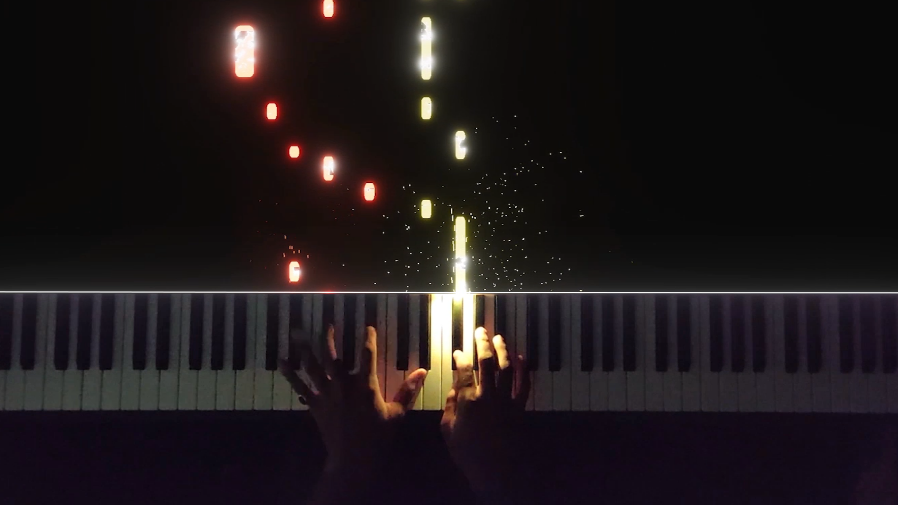

# Arduino-LED-Piano

## Arduino Code to light leds in MIDI signals , with 3 combinations of colors based on MIDI response.

* Arduino- Use either UNO or Leonardo 
* Software - PianoVFX
* OS- Windows*

### Features of the code

1. Division of Colors : Leds glows on key press , You can specify the notes you want to have your color divions and edit the color by typing RGB values. You can have 'n' no of -  divisions and colors.

2. Random Colors : Everytime you press a piano key it generates a random color on the leds.

3. Same color: This will have a single color on leds when you press a key. 

Thanks to PianoVFX - Kent to make this beautiful software . 
